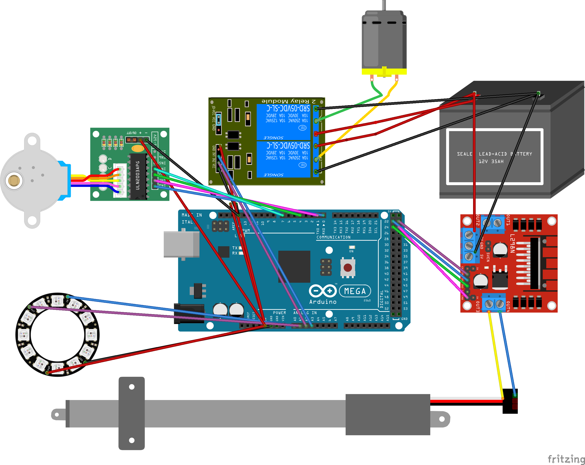

#   RobotFreedom Motion Control

Welcome to the official robotic control library maintained by HipMonsters.com. This is the Arduino code base for the Robot Freedom robots. 

 

## Table of Contents 

- [What's New](#what's-new)
- [Getting Started](#getting-started)  
- [Loading the Sketch](#loading-the-sketch)  
- [Deploying](#deploying)  
- [Components](#components) 
- [Wirings](#wiring)
- [Parts](#parts)
- [Testing](#testing)

## What's New

This library is still in the development stage.
 

## Getting Started

First, install the Arduino IDE on your prefered development OS. Linux, OXS and windows is supported. You can get the code <a href = "https://www.arduino.cc/en/software">here</a>.

Next, download the required library and copy them to your developement folder.

  - <a href="https://www.arduinolibraries.info/libraries/adafruit-bus-io">Adafruit_BusIO</a>
  - <a href="https://github.com/adafruit/Adafruit_BusIO">Adafruit_I2CDevice</a> 
  - <a href="https://github.com/adafruit/Adafruit-GFX-Library">Adafruit-GFX-Library</a>
  - <a href="https://github.com/FastLED/FastLED">FastLED</a>

Launch the Arduino IDE and from the menu bar select:
   Sketch>Include Library>Add Zip Library...

The point to one of the zip file you have downloaded. Repeat for each required library.

## Loading the Sketch

Double click on the movement_controller.ino file and the Arduino IDE should automatically launch. If it does not launch you can load the sketch by selecting File>Open then naviagte to your project file.

## Deploying

First choose a board type. When you connect your Arduino board it should be auto-detected by the IDE. For some brands you may have to mannual select it fromt he combo box. For off-brand Arduino we recommend searching forums for the best match. Many specify incorrect boards in their descriptions. 

Next select >Sketch>Verify Compile. At the bottom of the IDE a console will appear and provide a detailed log. If you missed any libraries your will recieve an error message. Loading any required libraries and try again.

Once the code is compiled select sktech>upload to deploy your code.

## Components

 - <a href="https://projecthub.arduino.cc/Fouad_Roboticist/dc-motors-control-using-arduino-pwm-with-l298n-h-bridge-25b3b3">H-Bridge</a>
 - <a href="https://www.amazon.com/Sparkleiot-Integrated-Individual-Addressable-Programmable/dp/B0C77W6P2B/ref=sxin_16_pa_sp_search_thematic_sspa?content-id=amzn1.sym.95e4d6bd-d93f-4ee1-9766-ff64f54d2f71%3Aamzn1.sym.95e4d6bd-d93f-4ee1-9766-ff64f54d2f71&crid=1Y0C140RRR4LP&cv_ct_cx=FastLED%2Bcircle&keywords=FastLED%2Bcircle&pd_rd_i=B0C77W6P2B&pd_rd_r=aca54696-aa8b-4063-bff9-d83d772533bc&pd_rd_w=r4I6x&pd_rd_wg=2IFrj&pf_rd_p=95e4d6bd-d93f-4ee1-9766-ff64f54d2f71&pf_rd_r=82QC8A44ZGPR18XX0J0X&qid=1742135925&s=industrial&sbo=RZvfv%2F%2FHxDF%2BO5021pAnSA%3D%3D&sprefix=fastled%2Bcircle%2Cindustrial%2C151&sr=1-4-6024b2a3-78e4-4fed-8fed-e1613be3bcce-spons&sp_csd=d2lkZ2V0TmFtZT1zcF9zZWFyY2hfdGhlbWF0aWM&th=1">FastLED </a>
 - <a href="https://www.amazon.com/Electric-High-Speed-sec-Weight-Intelligent-Automation/dp/B07ZJ4B272/ref=asc_df_B07ZJ4B272?tag=bingshoppinga-20&linkCode=df0&hvadid=80676758009315&hvnetw=o&hvqmt=e&hvbmt=be&hvdev=c&hvlocint=&hvlocphy=&hvtargid=pla-4584276306216125&th=1">Linear Actuator</a>

## Wiring 
  
The layout is shown below. 

    

## Testing

To test select Tools>Serial Monitor from the main menu. At the bottom of the IDE a new tab titled "Serial Monitor" will appear. From this console you can directly communicate with the Arduino. 

In the console window type "5". You should see a response from the Arduino in the console and if the LED is connected to the Arduino it should turn white and flash in a circular pattern. 

